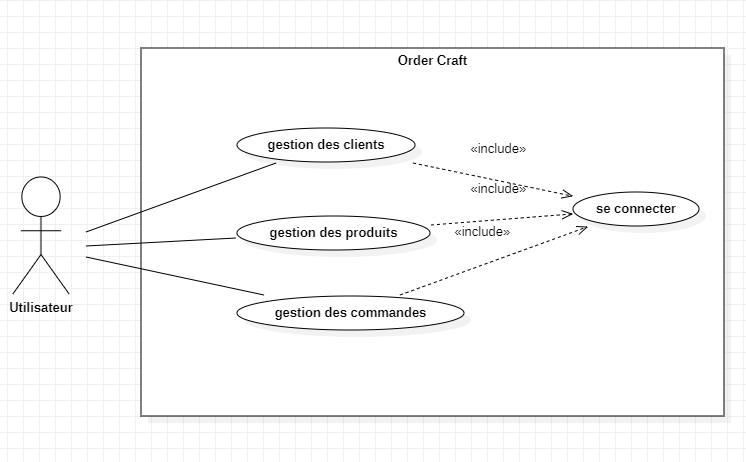
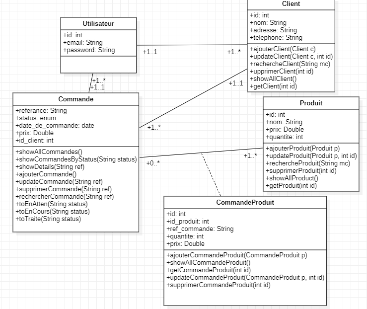

<h1 align="center">
  Java Titan Task
</h1>

## 📝 Table des Matières
- [Description](#description)
- [Objectifs du Projet](#project-goals)
- [Soft Skills](#soft-skills)
- [Conception](#conception)

## 🧐 Description 
Le projet "OrderCraft" vise à migrer l'application de gestion des commandes de l'entreprise artisanale ArtWood vers une architecture moderne basée sur Spring Core MVC avec Thymeleaf.
## 🎯 Objectifs du Projet 
Les objectifs du projet "OrderCraft" sont de moderniser l'application de gestion des commandes d'ArtWood en migrer vers une architecture Spring Core MVC avec Thymeleaf. Cette transition vise à améliorer la scalabilité de l'application tout en tirant parti des technologies les plus récentes. Les fonctionnalités clés incluent l'ajout de commandes convivial, la visualisation des commandes en cours, la gestion des clients, le suivi des stocks et la possibilité de marquer les commandes comme complètes. Ces objectifs visent à renforcer l'efficacité opérationnelle, à faciliter la prise de décision stratégique et à positionner ArtWood avec une infrastructure technologique moderne et évolutive.

1. Langage de Programmation : Java
2. Frontend : Thymeleaf pour les vues dynamiques
3. Backend : Spring Core ( IOC , DI ) - Spring MVC - Hibernate - Spring Data JPA
4. Gestion de Dépendances : Apache Maven
5. Base de Données : MySQL
6. Serveur d'Application : Apache Tomcat
7. Gestion des tâches : un outil de votre choix
8. Système de Gestion de Version : Git et Github
9. Logging : SLF4J (Simple Logging Facade for Java) pour la gestion des journaux

## 🤝 Soft Skills 
Ce projet est un projet de groupe, ce qui nous aidera à améliorer nos compétences interpersonnelles telles que :

- Travail d'équipe
- Communication
- Gestion du temps
- Résolution de problèmes

## 📝 Conception 
### Use Case Diagram

### Class Diagram

### Main features of the application :
- Login
- gestion des produits (lister, ajouter, modifier, supprimer)
- gestion des clients (lister, ajouter, modifier, supprimer)
- gestion des commandes (lister, ajouter, modifier, supprimer)

